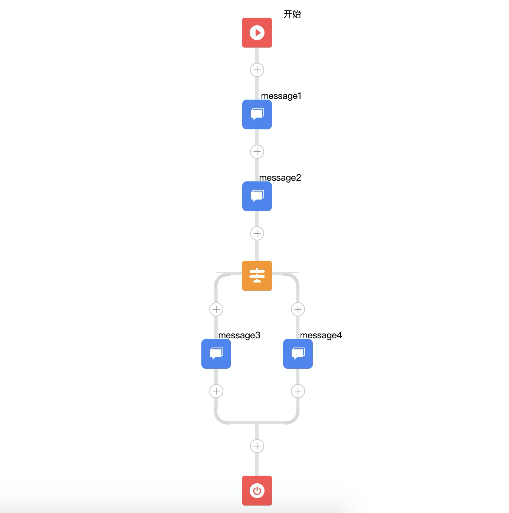

# action-dsl 转换需求

### 目标效果图



### action dsl

```python
message(1)
message(2)
if 1>2:
    message(3)
else:
    message(4)
end
```

### action dsl转换生成的抽象语法树

```json
{
  "type": "Statement",
  "left": {
    "type": "Statement",
    "left": {
      "type": "Statement",
      "left": {
        "type": "no-op"
      },
      "right": {
        "type": "message",
        "left": {
          "type": "NUMBER",
          "value": 1
        }
      }
    },
    "right": {
      "type": "message",
      "left": {
          "type": "NUMBER",
          "value": 2
      }
    }
  },
  "right": {
    "type": "ifelse",
    "left": {
      "type": ">",
      "left": {
        "type": "NUMBER",
        "value": 1
      },
      "right": {
        "type": "NUMBER",
        "value": 2
      }
    },
    "middle": {
      "type": "Statement",
      "left": {
        "type": "Statement",
        "left": {
          "type": "no-op"
        },
        "right": {
          "type": "no-op"
        }
      },
      "right": {
        "type": "message",
        "left": {
          "type": "NUMBER",
          "value": 3
        }
      }
    },
    "right": {
      "type": "Statement",
      "left": {
        "type": "Statement",
        "left": {
          "type": "no-op"
        },
        "right": {
          "type": "no-op"
        }
      },
      "right": {
        "type": "message",
        "left": {
          "type": "NUMBER",
          "value": 4
        }
      }
    }
  }
}
```

### 转换的目标json

```json
{
  "type": "message",
  "properties": {
    "title": "message1"
  },
  "childNode": {
    "type": "message",
    "properties": {
      "title": "message2"
    },
    "conditionNodes": [
      {
        "conditionType": "if",
        "type": "condition",
        "properties": {
          "title": "条件1"
        },
        "childNode": {
          "type": "message",
          "properties": {
            "title": "message3"
          }
        }
      },
      {
        "type": "condition",
        "conditionType": "if",
        "childNode": {
          "type": "message",
          "properties": {
            "title": "message4"
          }
        },
        "properties": {
          "title": "条件2"
        }
      }
    ]
  }
}
```